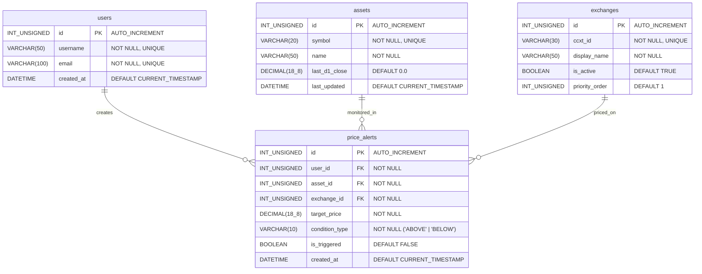

```mermaid
erDiagram
    users ||--o{ price_alerts : "creates"
    assets ||--o{ price_alerts : "monitored_in"
    exchanges ||--o{ price_alerts : "priced_on"

    users {
        INT_UNSIGNED id PK "AUTO_INCREMENT"
        VARCHAR(50) username "NOT NULL, UNIQUE"
        VARCHAR(100) email "NOT NULL, UNIQUE"
        DATETIME created_at "DEFAULT CURRENT_TIMESTAMP"
    }

    exchanges {
        INT_UNSIGNED id PK "AUTO_INCREMENT"
        VARCHAR(30) ccxt_id "NOT NULL, UNIQUE"
        VARCHAR(50) display_name "NOT NULL"
        BOOLEAN is_active "DEFAULT TRUE"
        INT_UNSIGNED priority_order "DEFAULT 1"
    }

    assets {
        INT_UNSIGNED id PK "AUTO_INCREMENT"
        VARCHAR(20) symbol "NOT NULL, UNIQUE"
        VARCHAR(50) name "NOT NULL"
        DECIMAL(18_8) last_d1_close "DEFAULT 0.0"
        DATETIME last_updated "DEFAULT CURRENT_TIMESTAMP"
    }

    price_alerts {
        INT_UNSIGNED id PK "AUTO_INCREMENT"
        INT_UNSIGNED user_id FK "NOT NULL"
        INT_UNSIGNED asset_id FK "NOT NULL"
        INT_UNSIGNED exchange_id FK "NOT NULL"
        DECIMAL(18_8) target_price "NOT NULL"
        VARCHAR(10) condition_type "NOT NULL ('ABOVE' | 'BELOW')"
        BOOLEAN is_triggered "DEFAULT FALSE"
        DATETIME created_at "DEFAULT CURRENT_TIMESTAMP"
    }
```